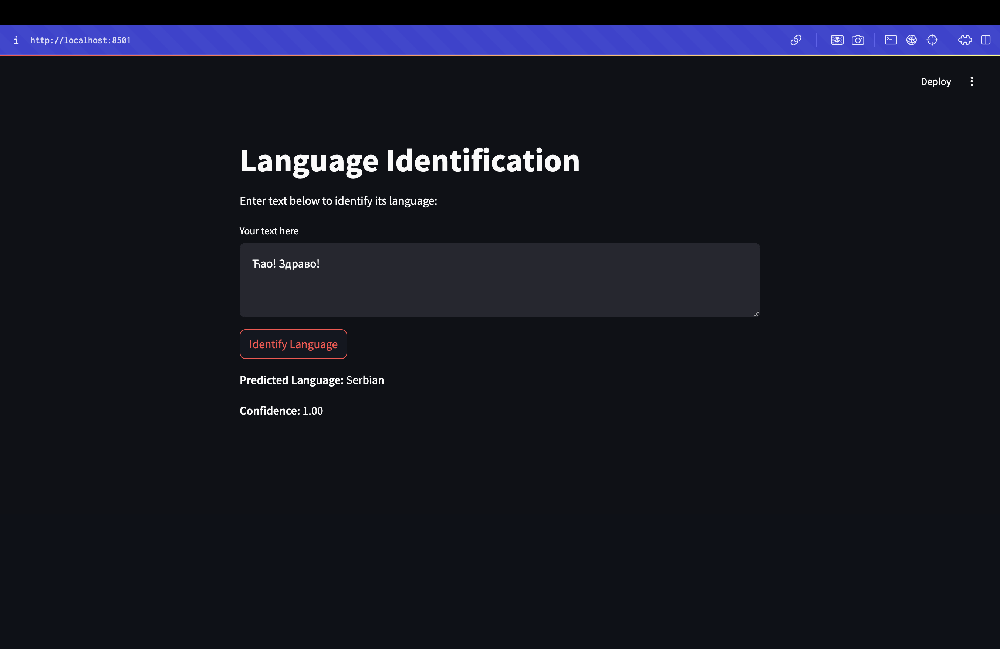

# ml_system_design

Домашнее задание по ml system design

## Пример работы

Скачать модель https://disk.yandex.ru/d/x3xB-q2khl1PIw

Запускать командой streamlit run app.py

Нужно подложить папку с чекпоинтом в корень проекта и назвать ее 'final_model', чтобы подгрузилась модель оттуда

